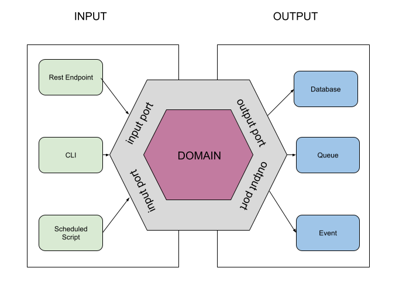

# Fraud Detection

This very simple and naive application has been created with the intention of show a possible
hexagonal architecture implementation using Spring Boot.
The main principle is to structure your application layers in a way that it receives a user interaction (input) and 
retrieves data from a source (output).



## Layers

The main objective of Hexagonal Architecture is design your software in a "pluggable" way. You should be able to make
your pieces interact without knowing nothing about each other. Your data source could be a database or a file, it doesn't
matter.

### Application

This layer contains all the user interaction parts. Here you will find Rest Endpoints, user interfaces or CLI components

```bash
src
  ├── main
     ├── java
         └── com
             └── hellolight
                 └── frauddetection
                     ├── application
                         ├── cli
                         │   └── FraudDetectionShell.java
                         └── rest
                             └── FraudDetectionController.java
```

### Domain

All your business logic remains on the domain.

```bash
src
 ├── main
...
                 ├── domain
                     ├── exception
                     │   └── FraudDetectionException.java
                     ├── model
                     │   ├── Reading.java
                     │   └── Result.java
                     ├── port
                     │   ├── input
                     │   │   └── FraudDetectionService.java
                     │   └── output
                     │       └── FileReadingsProvider.java
                     └── service
                         └── FraudDetectionServiceImpl.java
```

### Infrastructure

Inside our last layer we have all the output implementation. Here you can find Database, Cache, Files or any kind of data source that
implements the output port ReadingsProvider.

```bash
 ├── main
...
               └── infrastructure
                    ├── configuration
                    │   └── BeanConfiguration.java
                    ├── csv
                    │   ├── adapter
                    │   │ └── CsvReadingsAdapter.java
                    │   ├── converter
                    │   │   └── CsvReadingsToReadingsConverter.java
                    │   ├── dto
                    │   │   ├── CsvReadings.java
                    │   │   └── XmlReadings.java
                    │   └── helper
                    │       └── CsvHelper.java
                    ├── db
                    │   ├── adapter
                    │   │   └── DBReadingsAdapter.java
                    │   └── repository
                    │       └── ReadingsRepository.java
                    └── xml
                        ├── adapter
                        │   └── XmlReadingsAdapter.java
                        ├── converter
                        │   └── XmlReadingsToReadingsConverter.java
                        ├── dto
                        │   └── XmlReadings.java
                        └── helper
                            └── XmlHelper.java
```

### Notes

You can find multi-module and mono-module implementations all over the internet. I choose mono because of simplicity.
Thought it has several user interaction implementations like rest and cli (input), and a few
sources like database, CSV or XML files (output), currently it only works with files. The other implementations
are just for demonstration purposes.

## Running the application

The interaction with our application will be a shell. Once started you can run:

```bash
shell:>scan --fileName 2016-readings.csv
```

It will parse a list of light consumption readings list, searching for a 50% higher of the median one, in order to
detect a possible fraud and show a results table at the end:

```bash
| Client              | Month              | Suspicious         | Median   |
 ---------------------------------------------------------------------------
| 583ef6329d89b       | SEPTEMBER          | 162078             | 63849,75 |
```

### Dependencies

 - Java JDK 17

### Run Application

Execute:

```bash
$ cd ./fraud-detection
$ ./mvnw spring-boot:run
```